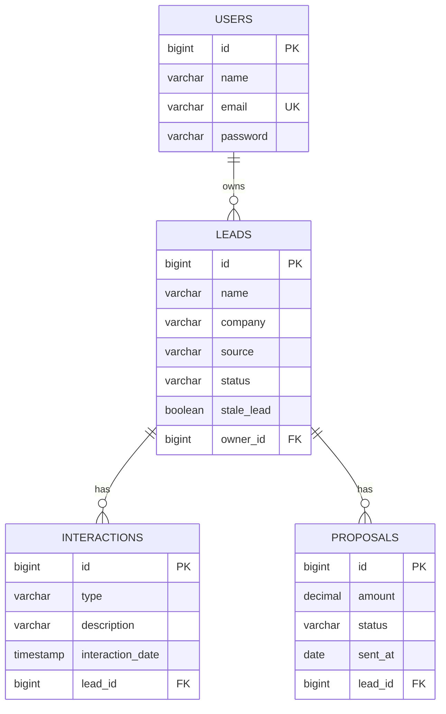
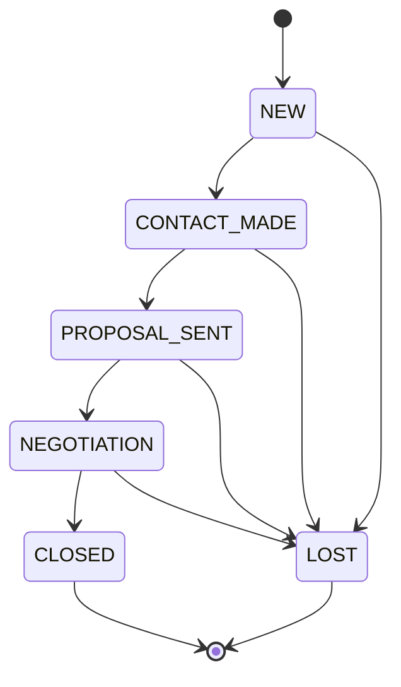

# Leadfy API

API REST de um mini-CRM de prospecção para freelancers, desenvolvida com Java e Spring Boot.

A aplicação permite que um freelancer cadastre leads (clientes em potencial), acompanhe
cada um por um funil de vendas com transições de status controladas, registre interações
(ligações, e-mails, reuniões) e propostas comerciais, e consulte métricas agregadas de
conversão. Cada freelancer só enxerga e gerencia os próprios dados — não existe
compartilhamento entre contas.

## Funcionalidades

- Cadastro e autenticação de freelancers com JWT
- Criptografia de senha com BCrypt
- Isolamento de dados por usuário em todas as camadas (leads, interações, propostas)
- Funil de leads com máquina de estados: `NEW → CONTACT_MADE → PROPOSAL_SENT → NEGOTIATION → CLOSED`, com `LOST` acessível a partir de qualquer etapa (exceto `CLOSED`)
- Registro de interações por lead, com tipo, descrição e data
- Registro de propostas por lead, com valor e status (`SENT`, `ACCEPTED`, `REJECTED`)
- Métricas agregadas: taxa de conversão geral, conversão por origem do lead, tempo médio até fechamento, distribuição de leads por status
- Job agendado que sinaliza leads sem interação há mais de N dias (configurável) como "parados"
- Tratamento centralizado de exceções, com respostas de erro padronizadas
- Documentação interativa com Swagger/OpenAPI
- Migrations versionadas com Flyway
- Testes unitários (JUnit 5 + Mockito) e de integração (Testcontainers + PostgreSQL real)
- Deploy com Docker Compose em um único comando

## Tecnologias

- Java 21
- Spring Boot 3
- Spring Web MVC
- Spring Security
- JWT (`java-jwt`)
- Spring Data JPA / Hibernate
- PostgreSQL
- Flyway
- Maven
- Swagger / OpenAPI (springdoc)
- JUnit 5, Mockito, AssertJ
- Testcontainers
- Docker / Docker Compose

## Arquitetura

O projeto segue uma arquitetura em camadas (Controller → Service → Repository), com DTOs
separados das entidades JPA — nenhuma entidade é exposta diretamente pela API.

```
src/main/java/com/leadfy/api
├── config          # Security, OpenAPI
├── controller       # Endpoints REST
├── dto
│   ├── request       # Payloads de entrada, validados com Bean Validation
│   └── response      # Payloads de saída
├── entity            # Entidades JPA
├── enums             # LeadStatus, LeadSource, InteractionType, ProposalStatus
├── exception         # Exceções de domínio + GlobalExceptionHandler
├── repository        # Spring Data JPA + queries de agregação
├── scheduler         # Job de leads parados
├── security           # JWT filter, token service, UserDetails
└── service
    └── impl            # Implementações + máquinas de estado de transição
```

- `security`: filtro JWT, geração/validação de token e carregamento do usuário autenticado
- `service.LeadStatusTransitionValidator` / `service.ProposalStatusTransitionValidator`: mapas de transições válidas por status — a regra do funil vive aqui, não espalhada em `if/else` pelos services
- `repository`: além dos métodos derivados, concentra as queries JPQL/nativas de agregação usadas pelo endpoint de métricas e pelo job de leads parados
- `exception` + `GlobalExceptionHandler` (`@RestControllerAdvice`): qualquer exceção de domínio vira uma resposta padronizada `{ code, message, timestamp }`

## Banco de Dados

O schema é versionado com Flyway (`src/main/resources/db/migration`) e aplicado
automaticamente na inicialização da aplicação. As configurações sensíveis são carregadas
por variáveis de ambiente, com defaults de desenvolvimento no `application.yml`:

```yaml
spring:
  datasource:
    url: ${DB_URL:jdbc:postgresql://localhost:5432/leadfy}
    username: ${DB_USERNAME:leadfy}
    password: ${DB_PASSWORD:leadfy}

security:
  jwt:
    secret: ${JWT_SECRET:leadfy-development-secret-change-me}

leadfy:
  stale-lead:
    threshold-days: ${STALE_LEAD_THRESHOLD_DAYS:7}
    cron: ${STALE_LEAD_CRON:0 0 2 * * *}
```

## Modelo Relacional

Um usuário (freelancer) possui vários leads; cada lead pertence a um único usuário e
acumula várias interações e propostas ao longo do tempo.



### Máquina de estados do funil



Transições fora desse grafo (ex.: `NEW → CLOSED` direto) são rejeitadas com
`409 Conflict` e o código `INVALID_LEAD_STATUS_TRANSITION`.

## Endpoints

### Autenticação

| Método | Endpoint | Descrição |
|--------|----------|-----------|
| POST | `/api/auth/register` | Cadastra um novo freelancer |
| POST | `/api/auth/login` | Autentica e retorna um token JWT |

### Leads

| Método | Endpoint | Descrição |
|--------|----------|-----------|
| POST | `/api/leads` | Cria um lead |
| GET | `/api/leads` | Lista os leads do usuário autenticado |
| GET | `/api/leads/stale` | Lista os leads sinalizados como parados |
| GET | `/api/leads/{leadId}` | Busca um lead por id |
| PUT | `/api/leads/{leadId}` | Atualiza os dados de um lead |
| PATCH | `/api/leads/{leadId}/status` | Atualiza o status do lead (validando a transição) |
| DELETE | `/api/leads/{leadId}` | Remove um lead |

### Interações

| Método | Endpoint | Descrição |
|--------|----------|-----------|
| POST | `/api/leads/{leadId}/interactions` | Registra uma interação no lead |
| GET | `/api/leads/{leadId}/interactions` | Lista interações do lead |
| GET | `/api/leads/{leadId}/interactions/{interactionId}` | Busca uma interação por id |
| PUT | `/api/leads/{leadId}/interactions/{interactionId}` | Atualiza uma interação |
| DELETE | `/api/leads/{leadId}/interactions/{interactionId}` | Remove uma interação |

### Propostas

| Método | Endpoint | Descrição |
|--------|----------|-----------|
| POST | `/api/leads/{leadId}/proposals` | Cria uma proposta para o lead |
| GET | `/api/leads/{leadId}/proposals` | Lista propostas do lead |
| GET | `/api/leads/{leadId}/proposals/{proposalId}` | Busca uma proposta por id |
| PUT | `/api/leads/{leadId}/proposals/{proposalId}` | Atualiza uma proposta |
| PATCH | `/api/leads/{leadId}/proposals/{proposalId}/status` | Atualiza o status da proposta |
| DELETE | `/api/leads/{leadId}/proposals/{proposalId}` | Remove uma proposta |

### Métricas

| Método | Endpoint | Descrição |
|--------|----------|-----------|
| GET | `/api/metrics/overview` | Totais, taxa de conversão geral e por origem, tempo médio até fechamento e distribuição por status |

Todos os endpoints acima (exceto `/api/auth/*`) exigem o header `Authorization: Bearer <token>`.

## Exemplos de Requisição

### Registrar e autenticar

```json
POST /api/auth/register
{
  "name": "Jane Doe",
  "email": "jane@leadfy.com",
  "password": "Secret123!"
}
```

```json
POST /api/auth/login
{
  "email": "jane@leadfy.com",
  "password": "Secret123!"
}
```

### Criar um lead

```json
POST /api/leads
{
  "name": "Acme Contact",
  "company": "Acme Inc",
  "email": "contact@acme.com",
  "source": "LINKEDIN",
  "notes": "Interessado em automação de processos"
}
```

### Avançar o status do lead

```json
PATCH /api/leads/{leadId}/status
{
  "status": "CONTACT_MADE"
}
```

### Registrar uma interação

```json
POST /api/leads/{leadId}/interactions
{
  "type": "CALL",
  "description": "Alinhamento inicial de escopo",
  "interactionDate": "2026-08-01T14:30:00"
}
```

### Criar uma proposta

```json
POST /api/leads/{leadId}/proposals
{
  "amount": 4500.00,
  "sentAt": "2026-08-05"
}
```

## Enums

**Status do lead (`LeadStatus`):** `NEW`, `CONTACT_MADE`, `PROPOSAL_SENT`, `NEGOTIATION`, `CLOSED`, `LOST`

**Origem do lead (`LeadSource`):** `REFERRAL`, `LINKEDIN`, `WEBSITE`, `OTHER`

**Tipo de interação (`InteractionType`):** `CALL`, `EMAIL`, `MEETING`, `WHATSAPP`, `OTHER`

**Status da proposta (`ProposalStatus`):** `SENT`, `ACCEPTED`, `REJECTED`

## Como Rodar Localmente

### Com Docker (recomendado)

Clone o repositório:
```bash
git clone https://github.com/matheuusprocopio/leadfy-api.git
cd leadfy-api
```

Suba a aplicação e o PostgreSQL com um único comando:
```bash
docker compose up --build
```

A API estará disponível em `http://localhost:8080` e o Swagger em
`http://localhost:8080/swagger-ui/index.html`. O PostgreSQL fica acessível em
`localhost:5544` (mapeado para fora da porta padrão 5432, para não colidir com uma
instância local já em uso).

### Sem Docker

Requer um PostgreSQL rodando localmente (ajuste `DB_URL`, `DB_USERNAME` e `DB_PASSWORD`
conforme necessário):

```bash
# Linux/macOS
./mvnw spring-boot:run

# Windows
mvnw.cmd spring-boot:run
```

## Testes

Testes unitários (services, isolados com Mockito — rápidos, sem dependências externas):
```bash
./mvnw test
```

Testes de integração (repositories e controllers contra um PostgreSQL real via
Testcontainers — requer Docker em execução):
```bash
./mvnw verify
```

## Docker

O `Dockerfile` usa build multi-stage: uma etapa compila o projeto com Maven sobre uma
imagem JDK 21, e a imagem final roda apenas o `.jar` gerado sobre uma imagem JRE 21
enxuta, como um usuário não-root. O `docker-compose.yml` orquestra essa imagem junto de
um container PostgreSQL, aguardando o banco ficar saudável antes de subir a aplicação.
