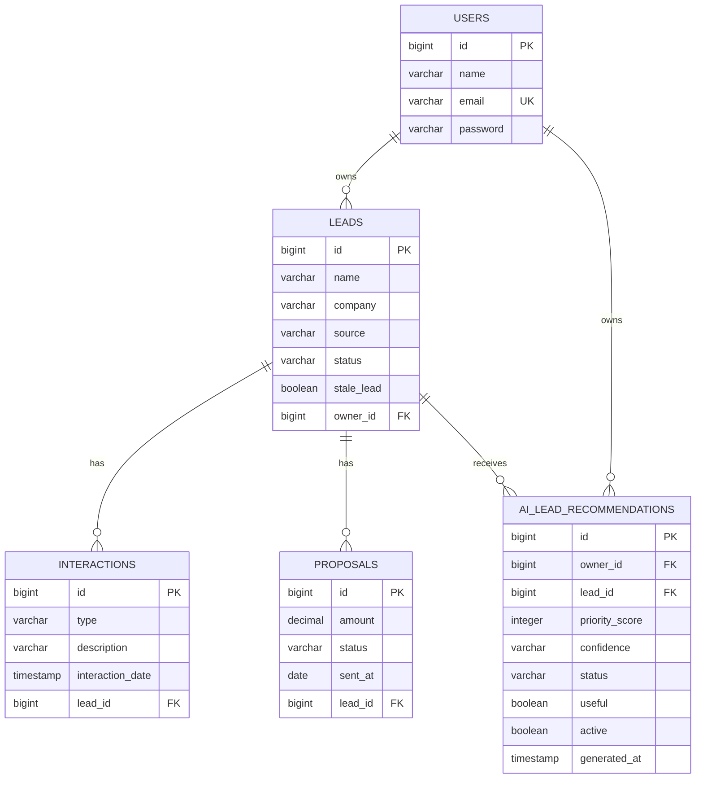
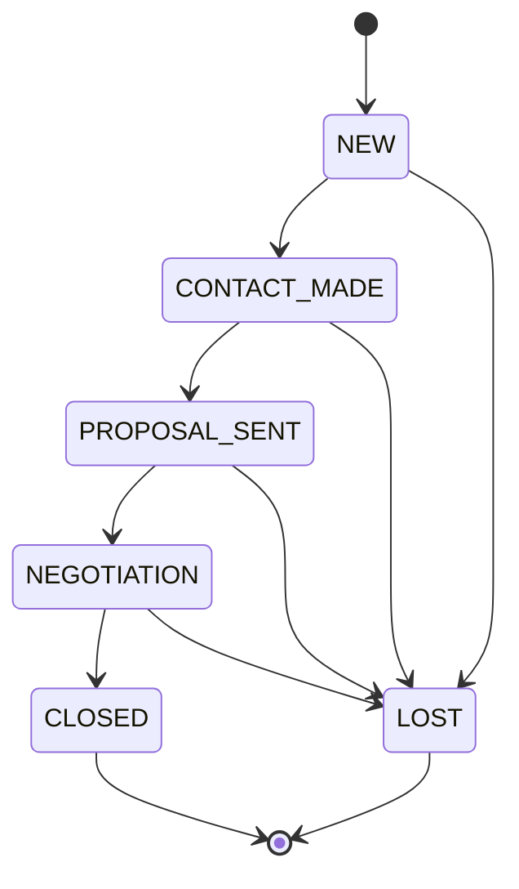

# Leadfy API

[](https://github.com/matheuusprocopio/leadfy-api/actions/workflows/ci.yml)

API REST de um mini-CRM de prospecção para freelancers, desenvolvida com Java e Spring Boot.

> **Deploy:** [leadfy-api.onrender.com](https://leadfy-api.onrender.com) — Swagger em
> [/swagger-ui/index.html](https://leadfy-api.onrender.com/swagger-ui/index.html).
> Hospedado no plano gratuito do Render: a primeira requisição pode levar alguns
> segundos caso o serviço esteja em repouso.

A aplicação permite que um freelancer cadastre leads (clientes em potencial), acompanhe
cada um por um funil de vendas com transições de status controladas, registre interações
(ligações, e-mails, reuniões) e propostas comerciais, e consulte métricas agregadas de
conversão. Cada freelancer só enxerga e gerencia os próprios dados — não existe
compartilhamento entre contas.

## Funcionalidades

- Cadastro e autenticação de freelancers com JWT
- Criptografia de senha com BCrypt
- Isolamento de dados por usuário em todas as camadas (leads, interações, propostas)
- Funil de leads com máquina de estados: `NEW → CONTACT_MADE → PROPOSAL_SENT → NEGOTIATION → CLOSED`, com `LOST` acessível a partir de qualquer etapa (exceto `CLOSED`)
- Registro de interações por lead, com tipo, descrição e data
- Registro de propostas por lead, com valor e status (`SENT`, `ACCEPTED`, `REJECTED`)
- Métricas agregadas: taxa de conversão geral, conversão por origem do lead, tempo médio até fechamento, distribuição de leads por status
- Job agendado que sinaliza leads sem interação há mais de N dias (configurável) como "parados"
- Leadfy AI Coach: análise inteligente do histórico comercial de um lead com recomendação de próximo contato
- Radar IA: geração persistida de prioridades comerciais, fila de próximas ações, feedback humano e métricas de impacto
- Listagens paginadas (leads, interações, propostas)
- Tratamento centralizado de exceções, com respostas de erro padronizadas
- Documentação interativa com Swagger/OpenAPI
- Migrations versionadas com Flyway
- Testes unitários (JUnit 5 + Mockito) e de integração (Testcontainers + PostgreSQL real)
- Pipeline de CI (GitHub Actions) rodando a suíte completa a cada push/PR
- Deploy com Docker Compose em um único comando

## Tecnologias

- Java 21
- Spring Boot 3
- Spring Web MVC
- Spring Security
- JWT (`java-jwt`)
- Spring Data JPA / Hibernate
- PostgreSQL
- Flyway
- Maven
- Swagger / OpenAPI (springdoc)
- OpenAI Responses API
- JUnit 5, Mockito, AssertJ
- Testcontainers
- Docker / Docker Compose
- Render (deploy)

## Deploy

A API está hospedada no Render, com deploy automático via Docker a partir da branch
`main`. A documentação interativa pode ser acessada em:

https://leadfy-api.onrender.com/swagger-ui/index.html

> O serviço utiliza o plano gratuito do Render. Se o serviço estiver em repouso, a
> primeira requisição pode levar alguns segundos até o container voltar a responder.

## Arquitetura

O projeto segue uma arquitetura em camadas (Controller → Service → Repository), com DTOs
separados das entidades JPA — nenhuma entidade é exposta diretamente pela API.

```
src/main/java/com/leadfy/api
├── client           # Clientes externos, como OpenAI
├── config          # Security, OpenAPI
├── controller       # Endpoints REST
├── dto
│   ├── request       # Payloads de entrada, validados com Bean Validation
│   └── response      # Payloads de saída
├── entity            # Entidades JPA
├── enums             # LeadStatus, LeadSource, InteractionType, ProposalStatus
├── exception         # Exceções de domínio + GlobalExceptionHandler
├── repository        # Spring Data JPA + queries de agregação
├── scheduler         # Job de leads parados
├── security           # JWT filter, token service, UserDetails
└── service
    └── impl            # Implementações + máquinas de estado de transição
```

- `security`: filtro JWT, geração/validação de token e carregamento do usuário autenticado
- `client`: integrações externas isoladas dos services, incluindo o client da OpenAI
- `service.LeadStatusTransitionValidator` / `service.ProposalStatusTransitionValidator`: mapas de transições válidas por status — a regra do funil vive aqui, não espalhada em `if/else` pelos services
- `repository`: além dos métodos derivados, concentra as queries JPQL/nativas de agregação usadas pelo endpoint de métricas e pelo job de leads parados
- `exception` + `GlobalExceptionHandler` (`@RestControllerAdvice`): qualquer exceção de domínio vira uma resposta padronizada `{ code, message, timestamp }`

## Banco de Dados

O schema é versionado com Flyway (`src/main/resources/db/migration`) e aplicado
automaticamente na inicialização da aplicação. As configurações sensíveis são carregadas
por variáveis de ambiente, com defaults de desenvolvimento no `application.yml`:

```yaml
spring:
  datasource:
    url: ${DB_URL:jdbc:postgresql://localhost:5544/leadfy}
    username: ${DB_USERNAME:leadfy}
    password: ${DB_PASSWORD:leadfy}

security:
  jwt:
    secret: ${JWT_SECRET:leadfy-development-secret-change-me}

leadfy:
  stale-lead:
    threshold-days: ${STALE_LEAD_THRESHOLD_DAYS:7}
    cron: ${STALE_LEAD_CRON:0 0 2 * * *}
  ai:
    openai:
      api-key: ${OPENAI_API_KEY:}
      model: ${OPENAI_MODEL:gpt-4o-mini}
      timeout-seconds: ${OPENAI_TIMEOUT_SECONDS:10}
    recommendation:
      cron: ${AI_RECOMMENDATION_CRON:0 30 7 * * *}
      max-leads-per-run: ${AI_RECOMMENDATION_MAX_LEADS_PER_RUN:25}
```

## Leadfy AI Coach

O Leadfy AI Coach usa a API da OpenAI no backend para analisar o histórico comercial de
um lead e sugerir o próximo melhor contato. O front-end nunca chama a OpenAI
diretamente; a chave fica somente no backend via `OPENAI_API_KEY`.

Dados enviados para a IA:

- Nome, empresa, origem, status, flag de lead parado e datas comerciais do lead
- Observações do lead, com normalização e truncamento
- Até 5 interações recentes, com tipo, descrição e data
- Até 5 propostas recentes, com valor, status e datas

Dados não enviados:

- Senha, JWT, e-mail do usuário autenticado ou qualquer dado interno do usuário
- E-mail e telefone do lead
- Chaves de API ou segredos de ambiente

Configuração:

| Variável | Descrição | Default |
|----------|-----------|---------|
| `OPENAI_API_KEY` | Chave usada pelo backend para chamar a OpenAI | vazio |
| `OPENAI_MODEL` | Modelo usado pelo AI Coach | `gpt-4o-mini` |
| `OPENAI_TIMEOUT_SECONDS` | Timeout da chamada externa | `10` |

Se `OPENAI_API_KEY` não estiver configurada, o endpoint retorna `503` com
`AI_INSIGHTS_UNAVAILABLE`. Erros do provedor ou respostas inválidas retornam `502`
com `AI_PROVIDER_ERROR` ou `AI_INVALID_RESPONSE`.

## Radar IA

O Radar IA reutiliza o mesmo pipeline de contexto e validação do Leadfy AI Coach, mas
persiste recomendações em `ai_lead_recommendations`. Cada recomendação guarda score,
resumo, sinais, próxima ação, mensagem sugerida, confiança, status de revisão e feedback
humano.

O job `AiLeadRecommendationScheduler` roda diariamente por padrão e renova recomendações
para leads abertos, priorizando leads parados e leads sem recomendação ativa recente.
Também é possível gerar uma recomendação sob demanda para um lead específico.

Status possíveis da recomendação:

- `PENDING`: recomendação ainda ativa na fila
- `ACTIONED`: usuário executou a ação recomendada
- `DISMISSED`: usuário decidiu não executar a recomendação

Quando uma recomendação é marcada como `ACTIONED` ou `DISMISSED`, ela deixa de aparecer
na fila ativa. As métricas continuam considerando o histórico para medir ação, utilidade
e conversão dos leads recomendados.

## Modelo Relacional

Um usuário (freelancer) possui vários leads; cada lead pertence a um único usuário e
acumula várias interações e propostas ao longo do tempo.



### Máquina de estados do funil



Transições fora desse grafo (ex.: `NEW → CLOSED` direto) são rejeitadas com
`409 Conflict` e o código `INVALID_LEAD_STATUS_TRANSITION`.

## Endpoints

### Autenticação

| Método | Endpoint | Descrição |
|--------|----------|-----------|
| POST | `/api/auth/register` | Cadastra um novo freelancer |
| POST | `/api/auth/login` | Autentica e retorna um token JWT |

### Leads

| Método | Endpoint | Descrição |
|--------|----------|-----------|
| POST | `/api/leads` | Cria um lead |
| GET | `/api/leads` | Lista os leads do usuário autenticado (paginado) |
| GET | `/api/leads/stale` | Lista os leads sinalizados como parados |
| GET | `/api/leads/{leadId}` | Busca um lead por id |
| POST | `/api/leads/{leadId}/ai-insights` | Gera a análise inteligente do Leadfy AI Coach |
| PUT | `/api/leads/{leadId}` | Atualiza os dados de um lead |
| PATCH | `/api/leads/{leadId}/status` | Atualiza o status do lead (validando a transição) |
| DELETE | `/api/leads/{leadId}` | Remove um lead |

### Interações

| Método | Endpoint | Descrição |
|--------|----------|-----------|
| POST | `/api/leads/{leadId}/interactions` | Registra uma interação no lead |
| GET | `/api/leads/{leadId}/interactions` | Lista interações do lead (paginado) |
| GET | `/api/leads/{leadId}/interactions/{interactionId}` | Busca uma interação por id |
| PUT | `/api/leads/{leadId}/interactions/{interactionId}` | Atualiza uma interação |
| DELETE | `/api/leads/{leadId}/interactions/{interactionId}` | Remove uma interação |

### Propostas

| Método | Endpoint | Descrição |
|--------|----------|-----------|
| POST | `/api/leads/{leadId}/proposals` | Cria uma proposta para o lead |
| GET | `/api/leads/{leadId}/proposals` | Lista propostas do lead (paginado) |
| GET | `/api/leads/{leadId}/proposals/{proposalId}` | Busca uma proposta por id |
| PUT | `/api/leads/{leadId}/proposals/{proposalId}` | Atualiza uma proposta |
| PATCH | `/api/leads/{leadId}/proposals/{proposalId}/status` | Atualiza o status da proposta |
| DELETE | `/api/leads/{leadId}/proposals/{proposalId}` | Remove uma proposta |

### Métricas

| Método | Endpoint | Descrição |
|--------|----------|-----------|
| GET | `/api/metrics/overview` | Totais, taxa de conversão, funil, leads parados e impacto das recomendações IA |

### Recomendações IA

| Método | Endpoint | Descrição |
|--------|----------|-----------|
| GET | `/api/ai/recommendations` | Lista recomendações IA ativas do usuário autenticado |
| POST | `/api/ai/recommendations/leads/{leadId}` | Gera e persiste uma recomendação IA para um lead |
| PATCH | `/api/ai/recommendations/{recommendationId}/feedback` | Registra feedback humano da recomendação |

Todos os endpoints acima (exceto `/api/auth/*`) exigem o header `Authorization: Bearer <token>`.

### Paginação

Os endpoints marcados como "paginado" aceitam os query params padrão do Spring Data:
`page` (0-indexado, default `0`), `size` (default `20`) e `sort` (ex.:
`sort=name,asc`). A resposta segue sempre o mesmo formato:

```json
{
  "content": [ ... ],
  "page": 0,
  "size": 20,
  "totalElements": 42,
  "totalPages": 3,
  "last": false
}
```

## Exemplos de Requisição

### Registrar e autenticar

```json
POST /api/auth/register
{
  "name": "Jane Doe",
  "email": "jane@leadfy.com",
  "password": "Secret123!"
}
```

```json
POST /api/auth/login
{
  "email": "jane@leadfy.com",
  "password": "Secret123!"
}
```

### Criar um lead

```json
POST /api/leads
{
  "name": "Acme Contact",
  "company": "Acme Inc",
  "email": "contact@acme.com",
  "source": "LINKEDIN",
  "notes": "Interessado em automação de processos"
}
```

### Avançar o status do lead

```json
PATCH /api/leads/{leadId}/status
{
  "status": "CONTACT_MADE"
}
```

### Registrar uma interação

```json
POST /api/leads/{leadId}/interactions
{
  "type": "CALL",
  "description": "Alinhamento inicial de escopo",
  "interactionDate": "2026-08-01T14:30:00"
}
```

### Criar uma proposta

```json
POST /api/leads/{leadId}/proposals
{
  "amount": 4500.00,
  "sentAt": "2026-08-05"
}
```

### Gerar análise inteligente do lead

```text
POST /api/leads/{leadId}/ai-insights
Authorization: Bearer <token>
```

Exemplo de resposta:

```json
{
  "priorityScore": 82,
  "summary": "Lead com boa chance de avanço, mas sem retorno recente.",
  "conversionSignals": [
    "Interesse registrado em automação",
    "Proposta já enviada"
  ],
  "riskSignals": [
    "Sem interação recente após o envio da proposta"
  ],
  "nextBestAction": "Enviar um follow-up consultivo retomando o valor da proposta.",
  "suggestedMessage": "Oi, tudo bem? Queria saber se ficou alguma dúvida sobre a proposta e se posso ajudar com o próximo passo.",
  "confidence": "MEDIUM",
  "generatedAt": "2026-08-24T22:30:00Z"
}
```

### Gerar prioridade IA para o dashboard

```text
POST /api/ai/recommendations/leads/{leadId}
Authorization: Bearer <token>
```

### Registrar feedback humano da recomendação

```json
PATCH /api/ai/recommendations/{recommendationId}/feedback
{
  "status": "ACTIONED",
  "useful": true
}
```

## Enums

**Status do lead (`LeadStatus`):** `NEW`, `CONTACT_MADE`, `PROPOSAL_SENT`, `NEGOTIATION`, `CLOSED`, `LOST`

**Origem do lead (`LeadSource`):** `REFERRAL`, `LINKEDIN`, `WEBSITE`, `OTHER`

**Tipo de interação (`InteractionType`):** `CALL`, `EMAIL`, `MEETING`, `WHATSAPP`, `OTHER`

**Status da proposta (`ProposalStatus`):** `SENT`, `ACCEPTED`, `REJECTED`

**Status da recomendação IA (`AiRecommendationStatus`):** `PENDING`, `ACTIONED`, `DISMISSED`

## Como Rodar Localmente

### Com Docker (recomendado)

Clone o repositório:
```bash
git clone https://github.com/matheuusprocopio/leadfy-api.git
cd leadfy-api
```

Suba a aplicação e o PostgreSQL com um único comando:
```bash
docker compose up --build
```

A API estará disponível em `http://localhost:8080` e o Swagger em
`http://localhost:8080/swagger-ui/index.html`. O PostgreSQL fica acessível em
`localhost:5544` (mapeado para fora da porta padrão 5432, para não colidir com uma
instância local já em uso).

### Sem Docker

Para rodar a API pelo Maven ou IntelliJ, suba apenas o PostgreSQL do Compose:

```bash
docker compose up -d db
```

Depois inicie a aplicação:

```bash
# Linux/macOS
./mvnw spring-boot:run

# Windows
mvnw.cmd spring-boot:run
```

O default local da API aponta para `jdbc:postgresql://localhost:5544/leadfy`,
que é a porta publicada pelo `docker-compose.yml`. Se você preferir usar outro
PostgreSQL, ajuste `DB_URL`, `DB_USERNAME` e `DB_PASSWORD`.

No IntelliJ IDEA, abra `src/main/java/com/leadfy/api/LeadfyApiApplication.java` e rode
a classe pelo botão verde. Se o banco do Compose estiver ativo, nenhuma variável de
ambiente extra é necessária.

## Testes

Testes unitários (services, isolados com Mockito — rápidos, sem dependências externas):
```bash
./mvnw test
```

Testes de integração (repositories e controllers contra um PostgreSQL real via
Testcontainers — requer Docker em execução):
```bash
./mvnw verify
```

## Docker

O `Dockerfile` usa build multi-stage: uma etapa compila o projeto com Maven sobre uma
imagem JDK 21, e a imagem final roda apenas o `.jar` gerado sobre uma imagem JRE 21
enxuta, como um usuário não-root. O `docker-compose.yml` orquestra essa imagem junto de
um container PostgreSQL, aguardando o banco ficar saudável antes de subir a aplicação.
